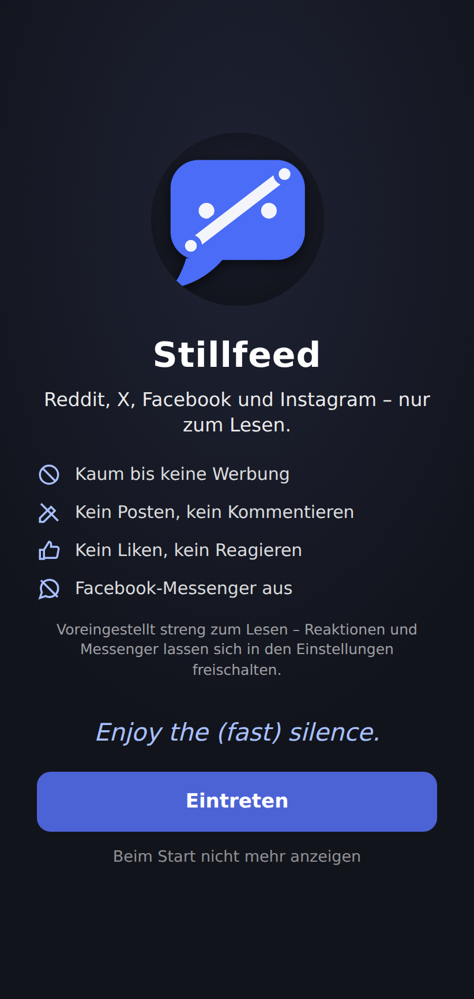
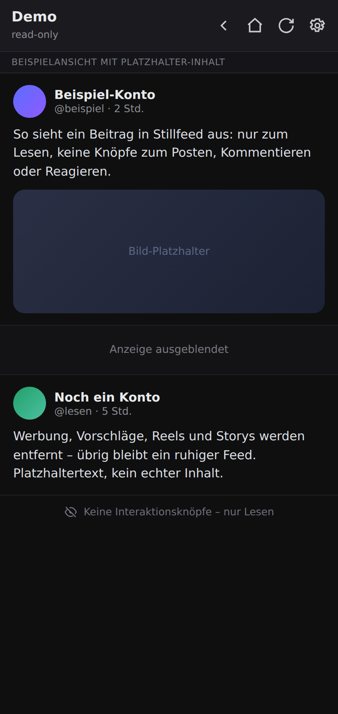
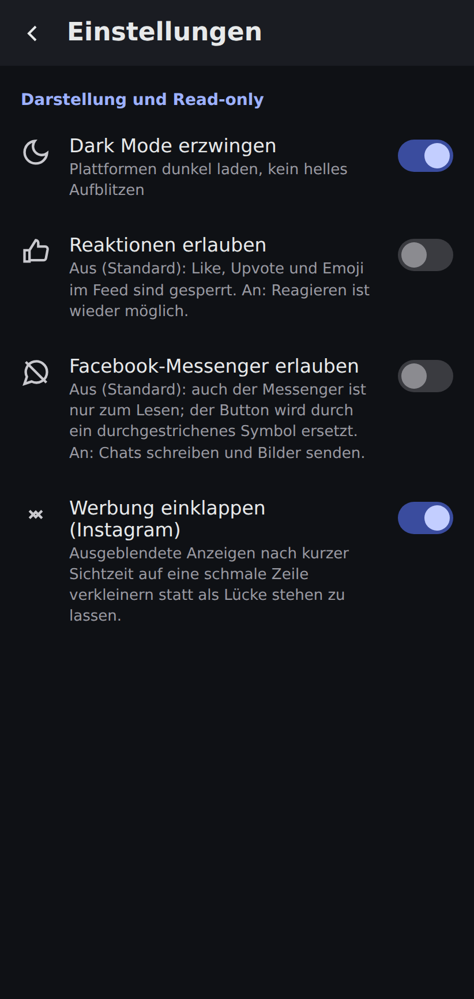
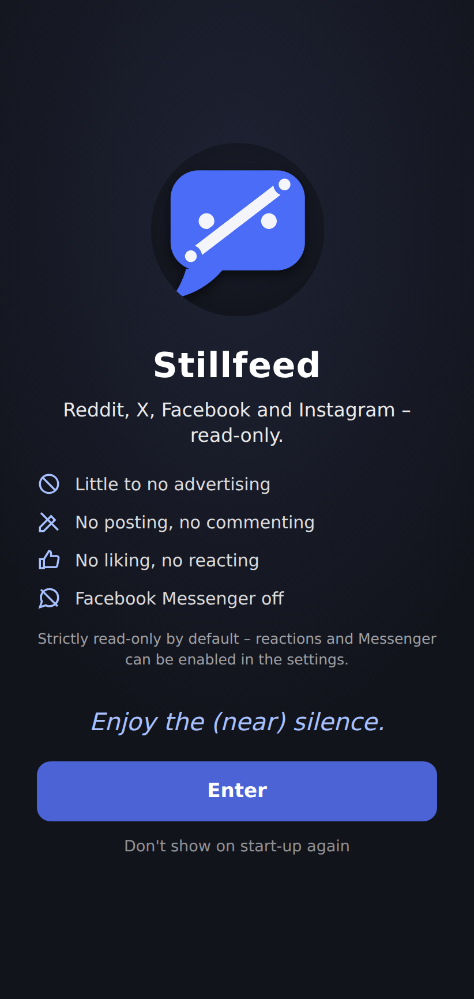
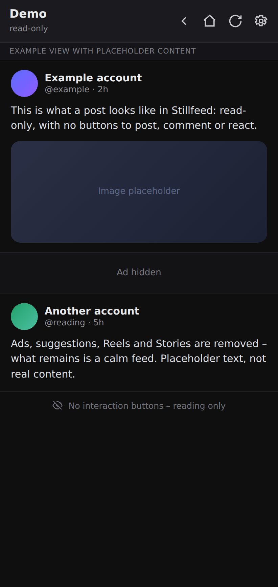
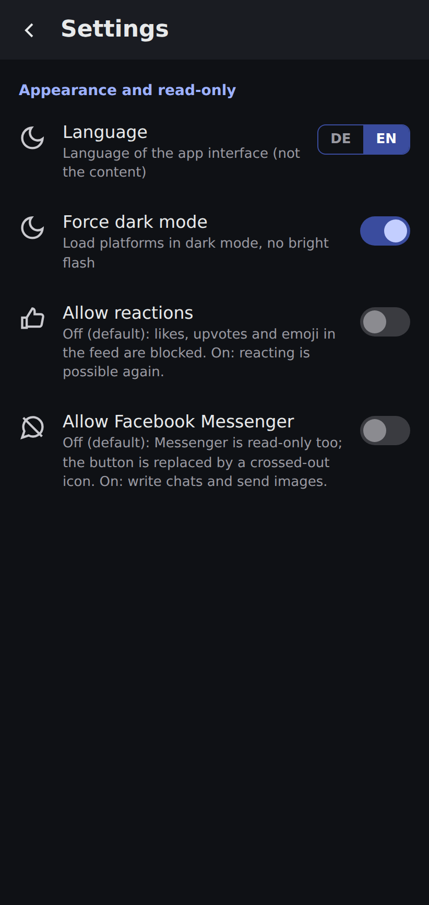

  

<h1 align="center">Stillfeed</h1>

  <b>Reddit, X, Facebook und Instagram – in einer App, nur zum Lesen.</b> 
  <b>Reddit, X, Facebook and Instagram – in one app, read-only.</b> 
  <i>Enjoy the (fast) silence.</i>

<a href="#deutsch">Deutsch</a> · <a href="#english">English</a>

> **Kurz gesagt:** Stillfeed ist zum **Lesen** gemacht – wie ein Buch. Du liest
> passiv und wirst nicht in den endlosen Sog aus Posten und Kommentieren
> gezogen: Posten und Kommentieren gibt es gar nicht erst. Reaktionen (Likes)
> kannst du optional zuschalten, wenn du möchtest – aber nichts drängt dich dazu.
>
> **In short:** Stillfeed is made for **reading** – like a book. You read
> passively and are never pulled into the endless loop of posting and
> commenting: posting and commenting simply aren't there. Reactions (likes) can
> optionally be enabled if you want – but nothing nudges you to.

> Dies ist die öffentliche Download- und Feedback-Seite. Der Quellcode ist
> privat, ein privates Heimprojekt, keine kommerzielle App. — This is the public
> download and feedback page. The source code is private; a personal hobby
> project, not a commercial app.

---

## Deutsch

Stillfeed bündelt vier soziale Netzwerke in einer ruhigen App zum Lesen. Es
liest sich wie ein Buch: rein passiv. **Posten und Kommentieren gibt es nicht**,
Werbung, Vorschlagsbeiträge, Reels, Storys und Spaces werden ausgeblendet.
**Reaktionen (Likes) sind ab Werk gesperrt** und lassen sich – wie der
Facebook-Messenger – bei Bedarf in den Einstellungen freischalten. Die App gibt
es auf **Deutsch und Englisch** (Umschalter oben rechts im Startbildschirm oder
in den Einstellungen).

  
  
  

Startbildschirm · Feed-Ansicht (Demo mit Platzhalter-Inhalt) · Einstellungen

### Installieren

1. Unter [**Releases**](../../releases) die neueste Version öffnen.
2. Die passende Datei laden:
   - **`stillfeed-<version>-arm64.apk`** – für aktuelle Android-Geräte (empfohlen).
   - `stillfeed-<version>-arm32.apk` – für ältere 32-Bit-Geräte.
   - `stillfeed-<version>.apk` – läuft auf allen Geräten, ist aber größer.
3. Die APK auf dem Gerät öffnen und die Installation aus „unbekannter Quelle"
   einmalig erlauben.
4. Updates lassen sich direkt über eine bestehende Installation legen, ohne
   vorher zu deinstallieren.

### Was die App kann

- **Wie ein Buch, nur zum Lesen:** keine Posten-, Antworten- oder Teilen-Knöpfe.
- **Reaktionen (Likes) optional:** ab Werk gesperrt, per Schalter zuschaltbar.
- **Werbung, Vorschläge, Reels, Storys** (Facebook) und **Spaces** (X) werden
  ausgeblendet.
- **Vier Plattformen, ein Fenster**, mit sofortigem Wechsel; einzelne
  Plattformen abschaltbar, Startplattform wählbar.
- **Facebook-Messenger** ist in den Einstellungen aktivierbar; dann voll nutzbar
  inklusive Bildversand. Solange er aus ist, steht an seiner Stelle ein
  durchgestrichenes, nicht klickbares Symbol.
- **Deutsch oder Englisch** umschaltbar (nur die App-Oberfläche).
- **Cookie-Abfragen** der Plattformen werden nicht weggeblendet; du entscheidest
  selbst.
- **Fingerabdruck-Sperre**, erzwingbarer Dark Mode, old.reddit-Option,
  Bild-Download per langem Tippen, Nur-Text-Ansicht für externe Links.
- **Datensparsam:** kein Server, keine Analyse, kein automatischer Kontozugriff.

### Bekannte Probleme (Stand 0.54.0)

Ein Heimprojekt, im Alltag stabil, aber nicht überall zu 100 % perfekt:

- **Reddit:** Direkt nach dem Start sind Beiträge manchmal noch nicht
  anklickbar – ein kurzes Wischen behebt es sofort. Beim Öffnen eines Beitrags
  dauert es kurz (unter einer Sekunde), bis der Posten-/Antworten-Knopf
  verschwindet. GIFs starten nicht von selbst.
- **X:** Ein Beitrag oder Video braucht gelegentlich einen kurzen Moment zum
  Laden. Fotos und Bilder werden problemlos angezeigt. Die schmale
  **Spaces-/Live-Leiste** ganz oben im Feed lässt sich derzeit nicht
  zuverlässig ausblenden – X baut sie ohne festes Merkmal und nur zeitweise ein;
  sie stört wenig und bleibt vorerst so.
- **Facebook:** Das Antwortfeld ist beim Öffnen kurz sichtbar, bevor es
  ausgeblendet wird. Manche Bilder im Feed sind links und rechts minimal
  beschnitten (leichter Overscan).
- **Instagram:** Nach dem Ausblenden einer Anzeige bleibt eine kleine dunkle
  Lücke stehen. Werbung wird nicht immer sofort erkannt; beim schnellen Scrollen
  kann das auffallen. Ein optionaler Einklappmodus verkleinert die Lücke.
- **Filter:** Nicht jede Werbung wird sofort erkannt; die Filter werden zentral
  nachgezogen, ohne dass es eine neue APK braucht.

### Feedback und Wünsche

Fehler oder Ideen gern als [**Issue**](../../issues) melden. Bei
Darstellungsfehlern hilft ein Screenshot. Kleine Wünsche (weitere
Filter-Stichwörter, Schalter, Bedien-Verbesserungen) nehme ich gern auf; große
Umbauten wie Posten oder Konten-Verwaltung sind bewusst nicht das Ziel.

### Lizenz

Alle Rechte vorbehalten. Der Quellcode ist nicht öffentlich; die
bereitgestellten APKs sind nur zum privaten Gebrauch gedacht.

---

## English

Stillfeed brings four social networks together in one calm app for reading. It
reads like a book: purely passive. **There is no posting and no commenting**;
ads, suggested posts, Reels, Stories and Spaces are hidden. **Reactions (likes)
are blocked by default** and – like Facebook Messenger – can be enabled in the
settings if you want. The app is available in **German and English** (switch at
the top right of the welcome screen or in the settings).

  
  
  

Welcome screen · Feed view (demo content) · Settings

### Install

1. Open the latest version under [**Releases**](../../releases).
2. Download the right file:
   - **`stillfeed-<version>-arm64.apk`** – for current Android devices (recommended).
   - `stillfeed-<version>-arm32.apk` – for older 32-bit devices.
   - `stillfeed-<version>.apk` – runs on any device, but is larger.
3. Open the APK on your device and allow installation from an "unknown source"
   once.
4. Updates can be installed straight over an existing install, without
   uninstalling first.

### What the app does

- **Like a book, read-only:** no post, reply or share buttons.
- **Reactions (likes) optional:** blocked by default, enable them with a switch.
- **Ads, suggestions, Reels, Stories** (Facebook) and **Spaces** (X) are hidden.
- **Four platforms, one window**, with instant switching; individual platforms
  can be turned off, start platform selectable.
- **Facebook Messenger** can be enabled in the settings; then fully usable
  including sending images. While off, a crossed-out, non-clickable icon takes
  its place.
- **German or English** interface (app UI only).
- **Cookie prompts** from the platforms are not hidden away; you decide yourself.
- **Fingerprint lock**, forced dark mode, old.reddit option, image download via
  long press, text-only view for external links.
- **Data-frugal:** no server, no analytics, no automatic account access.

### Known issues (as of 0.54.0)

A hobby project, stable in daily use, but not perfect everywhere:

- **Reddit:** Right after start, posts are sometimes not tappable yet – a short
  swipe fixes it. When opening a post it takes a brief moment (under a second)
  for the post/reply button to disappear. GIFs don't autostart.
- **X:** A post or video occasionally needs a brief moment to load. Photos and
  images display without issues. The thin **Spaces/live bar** at the very top of
  the feed can't currently be hidden reliably – X builds it without any stable
  marker and only intermittently; it's barely intrusive and stays for now.
- **Facebook:** The reply field is briefly visible when opening before it's
  hidden. Some images in the feed are slightly cut off left and right (minor
  overscan).
- **Instagram:** After hiding an ad, a small dark gap remains. Ads aren't always
  detected immediately; this can show when scrolling fast. An optional collapse
  mode shrinks the gap.
- **Filters:** Not every ad is detected right away; filters are updated centrally
  without needing a new APK.

### Feedback and requests

Please report bugs or ideas as an [**Issue**](../../issues). For display
glitches, a screenshot helps. Small requests (more filter keywords, switches,
usability tweaks) are welcome; big changes like posting or account management
are deliberately not the goal.

### License

All rights reserved. The source code is not public; the provided APKs are
intended for private use only.
